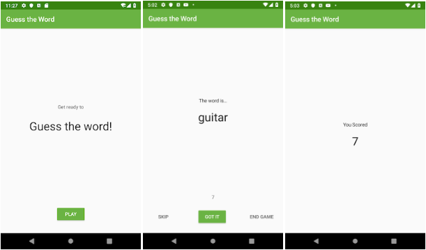

# GuessTheWord (ViewModel and ViewModelFactory)
record studying

what you will learn
------------
- 如何使用推荐的 Android `应用架构`。
- 如何在您的应用程序中使用 `Lifecycle`、 `ViewModel`和 `ViewModelFactory`类。
- 如何通过设备配置更改保留 UI 数据。
- 什么是`工厂方法`设计模式以及如何使用它。
- 如何`ViewModel`使用接口创建对象`ViewModelProvider.Factory`。

what you will do
------------
- 将 a 添加 `ViewModel`到应用程序，以保存应用程序的数据，以便数据在配置更改后仍然存在。
- 使用 `ViewModelFactory`工厂方法设计模式来实例化`ViewModel`带有构造函数参数的对象。

Introduction
------------
第一个玩家查看应用程序中的单词并依次表演每个单词，确保不要将单词显示给第二个玩家。第二个玩家试图猜测这个词。

### 应用架构
   GuessTheWord 应用所做的改进遵循 Android 应用架构指南，并且您使用 Android 架构组件。Android 应用架构类似于 MVVM（模型-视图-视图模型）架构模式。
   
### 界面控制器
  在 GuessTheWord 起始代码中，UI 控制器是三个片段：`GameFragment`,`ScoreFragment`,和`TitleFragment`。
  
### 视图模型
  A `ViewModel`保存要显示在与关联的片段或活动中的数据.在此架构中，ViewModel执行决策。保存GameViewModel分值、
  单词列表和当前单词等数据，因为这是要在屏幕上显示的数据。它还GameViewModel包含执行简单计算以确定数据当前状态的业务逻辑。
  
### 视图模型工厂
  A `ViewModelFactory`实例化`ViewModel`对象，有或没有构造函数参数。
